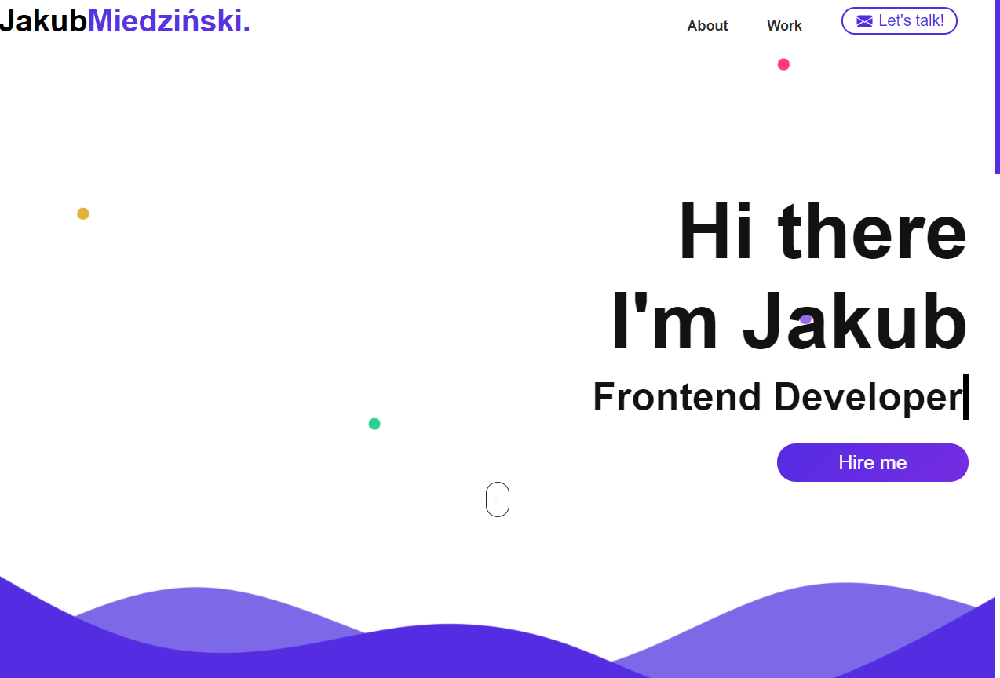

<h1 align="center">Portfolio</h1>

  

## Project Overview 🎉
Own portfolio created on the gatsby framework and styled with Styled-Components.

## Tech/framework used 🔧

| Tech                                                    | Description                              |
| ------------------------------------------------------- | ---------------------------------------- |
| [React]()                           | Used to build the site   |
| [Styled-Components](X)                           | Used to stylize the application|

## Installation 💾
Clone this repo to your desktop and run  `npm install`  to install all the dependencies.
Once the dependencies are installed, you can run  `gatsby develop`  to start the application. You will then be able to access it at http://localhost:8000
## Available scripts

| Command                   | Description                   |     |
| ------------------------- | ----------------------------- | --- |
| `gatsby develop`           | Open local server             |     |
| `gatsby build`             | Create optimized build        |     |

## Live 📍
https://jakubmiedzinski.netlify.app/
